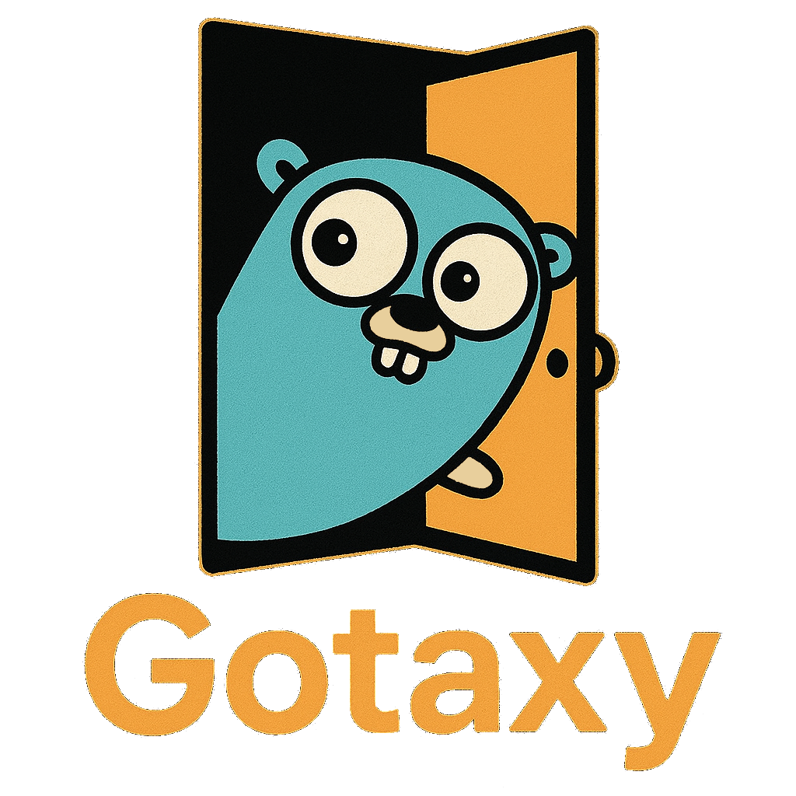

# Gotaxy

 

🚀 Gotaxy 是一款基于 Go 语言开发的轻量级内网穿透工具，帮助开发者将内网服务安全、便捷地暴露到公网。


#### _"Go beyond NAT, with style."_


---

###  🚀 快速开始

#### 服务端启动

```bash
go run cmd/server/server.go
```

##### 下载证书

- 在 http://localhost:9001 下载证书
- 或在命令行中:
```bash
gen-ca
gen-certs
```

##### 启动服务端

- 在网页端按下"启动服务"的按钮
- 或在命令行中执行:
```bash
start
```

#### 客户端连接

```bash
go run cmd/client/client.go -h ip -p port
```
---

### 需求文档

详细需求分析请参阅 [REQUIREMENTS.md](docs/REQUIREMENTS.md) 文件。

---

### 提交贡献 

欢迎提交 Issue 和 Pull Request。

如果要贡献代码，请查阅 [CONTRIBUTING.md.md](docs/CONTRIBUTING.md) 文件

提交代码请阅读 [COMMIT_CONVENTION.md](docs/COMMIT_CONVENTION.md)，我们遵循 [Conventional Commits](https://www.conventionalcommits.org/) 规范

---

<h3 align="left">贡献墙</h3>


<a href="https://github.com/JustGopher/Gotaxy/graphs/contributors">


</a>

<br />
<br />